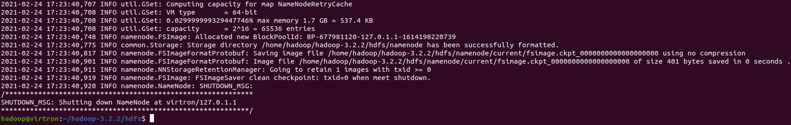

# Instalação Hadoop

A instalação foi feita em um ambiente linux usando o Ubuntu 20.04


1. Instalar OPENJDK e verificar a instalação
```bash
apt install openjdk-8-jdk -y
```


2. Instalar SSH, RSync e pdsh e verificar instalaçao

```bash
apt install ssh rsync pdsh
```


3. Criar novo usuário para o Hadoop e gerar chave rsa.

```bash
useradd -s /bin/bash -m -p hadoop hadoop
sudo su - hadoop
ssh-keygen -t rsa -P ""
cat $HOME/.ssh/id_rsa.pub >> $HOME/.ssh/authorized_keys
ssh localhost
```

4. Fazer Download Hadoop e descompactar

```bash
wget https://downloads.apache.org/hadoop/common/hadoop-3.2.2/hadoop-3.2.2.tar.gz
mv hadoop-3.2.2.tar.gz /home/hadoop/
cd /home/hadoop/
tar zxf hadoop-3.2.2.tar.gz
```


5. Criar Váriaveis de ambiente para o sistema

```bash
# abrir o arquivo /etc/enviroment e colocar o seguinte conteudo
JAVA_HOME=/usr/lib/jvm/java-1.8.0-openjdk-amd64
HADOOP_HOME=/home/hadoop/hadoop-3.2.2
PATH=$PATH:$HADOOP_HOME/bin
PDSH_RCMD_TYPE=ssh

# o mesmo deve ser feito para o seguinte arquivo, mas com export no inicio da linha
# $HADOOP_HOME/etc/hadoop/hadoop-env.sh

export JAVA_HOME=/usr/lib/jvm/java-1.8.0-openjdk-amd64
export HADOOP_HOME=/home/hadoop/hadoop-3.2.2
export PATH=$PATH:$HADOOP_HOME/bin
```

6. Adicionar as seguintes linhas ao arquivo $HADOOP_HOME/etc/hadoop/core-site.xml

```xml
<configuration>
    <property>
        <name>fs.defaultFS</name>
        <value>hdfs://localhost:9000</value>
    </property>
</configuration>
```

7. Adcionar as seguintes linhas ao arquivo $HADOOP_HOME/etc/haddop/hdfs-site.xml

```xml
<configuration>
    <property>
        <name>dfs.replication</name>
        <value>1</value>
    </property>
    <property>
        <name>dfs.namenode.name.dir</name>
        <value>/home/hadoop/hadoop-3.2.2/hdfs/namenode</value>
    </property>
    <property>
        <name>dfs.datanode.data.dir</name>
        <value>/home/hadoop/hadoop-3.2.2/hdfs/datanode</value>
    </property>
    <property>
■       <name>dfs.permissions</name>
■       <value>false</value>
    </property>
</configuration>
```

8. Criar as pastas datanode e namenode

```bash
mkdir hdfs
cd hdfs
mkdir datanode
mkdir namenode
```


9. Formatar o file system como hdfs

```bash
$HADOOP_HOME/bin/hdfs namenode -format
```



10 - Configurar PDSH

```bash
pdsh -q -w localhost
jps
```


11. Iniciar o cluster HDFS

```bash 
$HADOOP_HOME/sbin/start-dfs.sh
```


12. Acessar a seguinte URL ( http://localhost:9870 ) para validar o funcionamento do cluster Hadoop


***
#### Atividade 01 - Mapper e Reducer

1. Importar script Python para fazer função de Mapper, adicionar permissão de execução.

```python
#!/usr/bin/env python3

import sys

# input comes from STDIN (standard input)
for line in sys.stdin:
    # remove leading and trailing whitespace
    line = line.strip()
    # split the line into words
    words = line.split()
    # increase counters
    for word in words:
        # write the results to STDOUT (standard output);
        # what we output here will be the input for the
        # Reduce step, i.e. the input for reducer.py
        #
        # tab-delimited; the trivial word count is 1
        print ('%s\t%s' % (word, 1))
```

2. Testando mapper usando arquivo lorem_impsum.txt

```bash
cat lorem_impsum.txt |./mapper.py

# OUTPUT

Lorem	        1
ipsum	        1
dolor	        1
sit             1
amet,	        1
consectetur     1
adipiscing      1
elit,           1
sed	        1
do	        1
```

3. Importar script Python para fazer função de Reduccer, adicionar permissão de execução.

```python
#!/usr/bin/env python3

from operator import itemgetter
import sys

current_word = None
current_count = 0
word = None

# input comes from STDIN
for line in sys.stdin:
# remove leading and trailing whitespace
    line = line.strip()

    # parse the input we got from mapper.py
    word, count = line.split('\t', 1)

    # convert count (currently a string) to int
    try:
        count = int(count)
    except ValueError:
        # count was not a number, so silently
        # ignore/discard this line
        continue

    # this IF-switch only works because Hadoop sorts map output
    # by key (here: word) before it is passed to the reducer
    if current_word == word:
        current_count += count
    else:
        if current_word:
            # write result to STDOUT
            print ('%s\t%s' % (current_word, current_count))
        current_count = count
        current_word = word

# do not forget to output the last word if needed!
if current_word == word:
    print ('%s\t%s' % (current_word, current_count))
```

4. Testando reducer usando arquivo lorem_impsum.txt

```bash
cat lorem_impsum.txt | ./mapper.py | sort | ./reducer.py

# OUTPUT

a           66
a.          14
A           15
ac          90
ac.         14
Ac          16
accumsan    23
accumsan.   5
Accumsan    5
adipiscing  73
```

#### Atividade 02 - Streaming API

1. Criar pasta de input do hdfs

```bash
hdfs dfs -mkdir /wc
hdfs dfs -mkdir /wc/input
```

2. Carregar arquivos de execução de exemplo e verificar na interface do Hadoop.


```bash
hdfs dfs -copyFromLocal ./texto1.txt /wc/input
hdfs dfs -copyFromLocal ./texto2.txt /wc/input  
```


3. Execultar Map Reduce via Streaming API e verificar resultado

```bash
hadoop jar $HADOOP_HOME/share/hadoop/tools/lib/hadoop-streaming-3.2.2.jar -files mapper.py,reducer.py -mapper mapper.py -reducer reducer.py -input /wc/input -output /wc/output
```

Verificando saida do comando


Verificando arquivos no hadoop


Verificando conteudo do arquivo gerado no output

