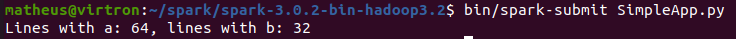

***
# Instalação Spark

A instalação foi feita em um ambiente linux usando o Ubuntu 20.04

1. Fazer o Download e Descompactar o Spark

```bash
wget https://downloads.apache.org/spark/spark-3.0.2/spark-3.0.2-bin-hadoop3.2.tgz
tar zvfx spark-3.0.2-bin-hadoop3.2.tgz
```


2. Setar variável de ambiente para o spark reconhecer o python, e execultar o shell interativo do spark

```bash
export PYSPARK_PYTHON=python3

bin/pyspark
```


3. Testar o seguinte código no spark

```python
lines = sc.textFile("README.md")
lines.count()
lines.first()
```


***

4. Execultar o Spark a partir de um arquivo .py.

Criar um arquivo com o seguinte código em python.

```python
from pyspark import SparkConf, SparkContext

if __name__ == "__main__":
    conf = SparkConf().setMaster("local").setAppName("My App")
    sc = SparkContext(conf = conf)
    print("ops, sc: %s" % sc)
```

Para testar pode ser usado o spark submit da seguinte forma

```bash
$SPARK_HOME/bin/spark-submit $EXAMPLE_HOME/watch-context.py
```

***

5. Execultar exemplo clássico do wordcount.

bin/spark-submit examples/src/main/python/wordcount.py README.md


***

## Exercicio - Slide 98 - Adaptar o script wordcount para fazer a contagem de palavras por comprimento da palavra

Segue código adaptado para resolução do exercicio.

```python

from __future__ import print_function

import sys
from operator import add

from pyspark.sql import SparkSession


if __name__ == "__main__":
    if len(sys.argv) != 2:
        print("Usage: wordcount <file>", file=sys.stderr)
        sys.exit(-1)

    spark = SparkSession\
        .builder\
        .appName("PythonWordCount")\
        .getOrCreate()

    lines = spark.read.text(sys.argv[1]).rdd.map(lambda r: r[0])
    counts = lines.flatMap(lambda x: x.split(' ')) \
                  .map(lambda x: (x, 1)) \
                  .reduceByKey(add)
    output = counts.collect()


    ####################################################################################################
    #
    # CODIGO ALTERADO A PARTIR DESSE PONTO PARA RESOLUCAO
    #
    ####################################################################################################


    #print(output)
    
    wordcountbylength = dict()
    for (word, count) in output:
        # pega o comprimento da palavra
        length = len(word)

        # verifica se uma entrada para palavras com esse comprimento ja foi criado
        # se existir entao soma o valor de palavras aos valores ja existentes
        if length in wordcountbylength:
            wordcountbylength[length] = wordcountbylength[length] + count

        
        else:
            # se nao cria um novo para de chave e valor

            wordcountbylength[length] = count

    # print do numero de palavras por comprimento

    for comprimento, quantidade in wordcountbylength.items():
        print(f'{comprimento}:\t\t{quantidade}')


    spark.stop()

```

Execução e resultado

```bash
bin/spark-submit wordcountbylength.py README.md
```


***

## Exercicios - Slide 99 a 101

1. SimpleApp.py, conta a quantidade de linhas com ‘a’ e a quantidade de
linhas com ‘b’ de uma entrada:

```python
# "SimpleApp.py"
import os
#print(os.environ['HOME'])
from pyspark.sql import SparkSession

logFile = os.environ['SPARK_HOME'] + "/README.md"

spark = SparkSession.builder.appName("SimpleApp").getOrCreate()

logData = spark.read.text(logFile).cache()

numAs = logData.filter(logData.value.contains('a')).count()
numBs = logData.filter(logData.value.contains('b')).count()

print("Lines with a: %i, lines with b: %i" % (numAs, numBs))

spark.stop()
```




<br><br><br>

2. Pi.py, calcula o número Pi com método de convergência numérica e de
forma paralela:

```python
from __future__ import print_function

import sys
from random import random
from operator import add
from pyspark.sql import SparkSession

spark = SparkSession\
            .builder\
            .appName("PythonPi")\
            .getOrCreate()

partitions = int(sys.argv[1]) if len(sys.argv) > 1 else 2
n = 100000 * partitions

def f(_):
    x = random() * 2 - 1
    y = random() * 2 - 1
    return 1 if x ** 2 + y ** 2 <= 1 else 0


count = spark.sparkContext.parallelize(range(1, n + 1), partitions).map(f).reduce(add)

print("Pi is roughly %f" % (4.0 * count / n))

spark.stop()
```


<br><br><br>

3. WordCount: com ordenação:

```python
from __future__ import print_function

import sys
from operator import add
from pyspark.sql import SparkSession

if len(sys.argv) != 2:
    print("Usage: wordcount <file>", file=sys.stderr)
    sys.exit(-1)

spark = SparkSession\
            .builder\
            .appName("PythonWordCount")\
            .getOrCreate()

lines = spark.read.text(sys.argv[1]).rdd.map(lambda r: r[0])

counts = lines.flatMap(lambda x: x.split(' ')) \
                        .map(lambda x: (x, 1)) \
                        .reduceByKey(add)

outputSorted = counts.sortByKey().collect()

for (word, count) in outputSorted:
    print("%s: %i" % (word, count))

spark.stop()
```

