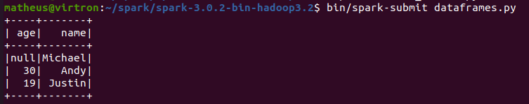
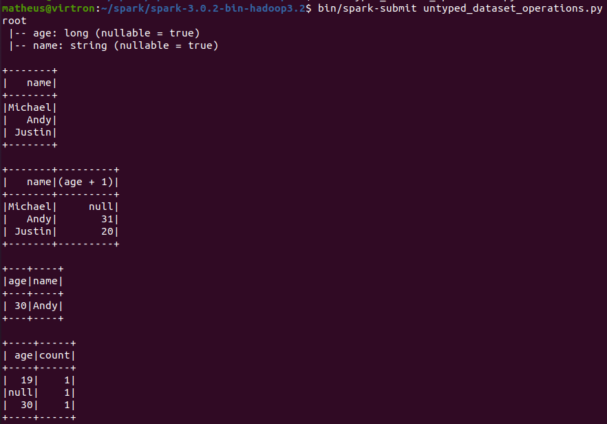
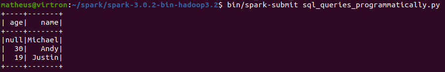
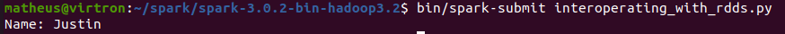
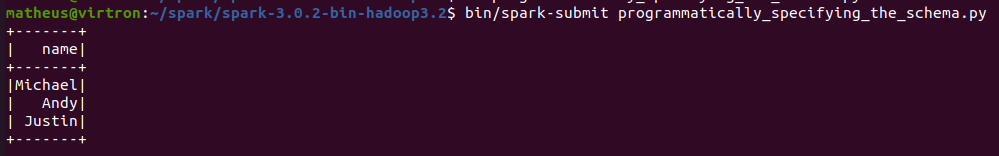

#### Creating DataFrames

```python
from pyspark.sql import SparkSession

spark = SparkSession \
    .builder \
    .appName("Python Spark SQL basic example") \
    .config("spark.some.config.option", "some-value") \
    .getOrCreate()


df = spark.read.json("examples/src/main/resources/people.json")
# Displays the content of the DataFrame to stdout
df.show()
```



***
### Untyped Dataset Operations
```python

from pyspark.sql import SparkSession

spark = SparkSession \
    .builder \
    .appName("Python Spark SQL basic example") \
    .config("spark.some.config.option", "some-value") \
    .getOrCreate()

df = spark.read.json("examples/src/main/resources/people.json")

df.printSchema()

# Select only the "name" column
df.select("name").show()

# Select everybody, but increment the age by 1
df.select(df['name'], df['age'] + 1).show()

# Select people older than 21
df.filter(df['age'] > 21).show()

# Count people by age
df.groupBy("age").count().show()

```

Resultado



***
### Running SQL Queries Programmatically

```python
from pyspark.sql import SparkSession

spark = SparkSession \
    .builder \
    .appName("Python Spark SQL basic example") \
    .config("spark.some.config.option", "some-value") \
    .getOrCreate()

df = spark.read.json("examples/src/main/resources/people.json")

# Register the DataFrame as a SQL temporary view
df.createOrReplaceTempView("people")

sqlDF = spark.sql("SELECT * FROM people")
sqlDF.show()
```



***
### Global Temporary View


```python
from pyspark.sql import SparkSession

spark = SparkSession \
    .builder \
    .appName("Python Spark SQL basic example") \
    .config("spark.some.config.option", "some-value") \
    .getOrCreate()

df = spark.read.json("examples/src/main/resources/people.json")

# Register the DataFrame as a global temporary view
df.createGlobalTempView("people")

# Global temporary view is tied to a system preserved database `global_temp`
spark.sql("SELECT * FROM global_temp.people").show()

# Global temporary view is cross-session
spark.newSession().sql("SELECT * FROM global_temp.people").show()

```


***
### Interoperating with RDDs

```python
from pyspark.sql import Row, SparkSession

spark = SparkSession \
    .builder \
    .appName("Python Spark SQL basic example") \
    .config("spark.some.config.option", "some-value") \
    .getOrCreate()

sc = spark.sparkContext

# Load a text file and convert each line to a Row.
lines = sc.textFile("examples/src/main/resources/people.txt")
parts = lines.map(lambda l: l.split(","))
people = parts.map(lambda p: Row(name=p[0], age=int(p[1])))

# Infer the schema, and register the DataFrame as a table.
schemaPeople = spark.createDataFrame(people)
schemaPeople.createOrReplaceTempView("people")

# SQL can be run over DataFrames that have been registered as a table.
teenagers = spark.sql("SELECT name FROM people WHERE age >= 13 AND age <= 19")

# The results of SQL queries are Dataframe objects.
# rdd returns the content as an :class:`pyspark.RDD` of :class:`Row`.
teenNames = teenagers.rdd.map(lambda p: "Name: " + p.name).collect()
for name in teenNames:
    print(name)
# Name: Justin
```



***
### Programmatically Specifying the Schema

```python
from pyspark.sql SparkSession
# Import data types
from pyspark.sql.types import *

spark = SparkSession \
    .builder \
    .appName("Python Spark SQL basic example") \
    .config("spark.some.config.option", "some-value") \
    .getOrCreate()

sc = spark.sparkContext

# Load a text file and convert each line to a Row.
lines = sc.textFile("examples/src/main/resources/people.txt")
parts = lines.map(lambda l: l.split(","))
# Each line is converted to a tuple.
people = parts.map(lambda p: (p[0], p[1].strip()))

# The schema is encoded in a string.
schemaString = "name age"

fields = [StructField(field_name, StringType(), True) for field_name in schemaString.split()]
schema = StructType(fields)

# Apply the schema to the RDD.
schemaPeople = spark.createDataFrame(people, schema)

# Creates a temporary view using the DataFrame
schemaPeople.createOrReplaceTempView("people")

# SQL can be run over DataFrames that have been registered as a table.
results = spark.sql("SELECT name FROM people")

results.show()
# +-------+
```

